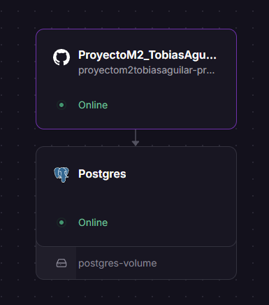
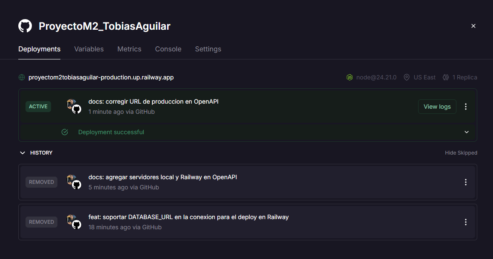
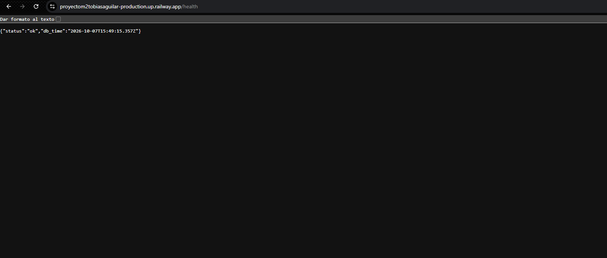
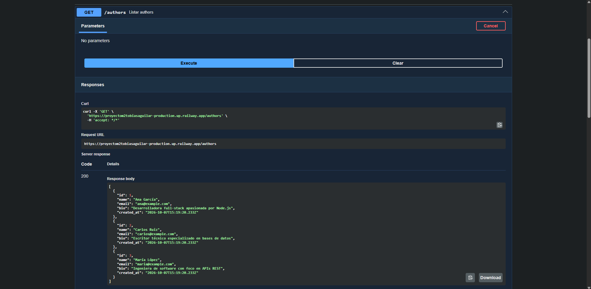

# MiniBlog API

API REST desarrollada con **Node.js + Express + PostgreSQL** para gestionar **authors** y **posts** (modelo tipo JSONPlaceholder).

Proyecto Integrador del Módulo 2 – Full Stack (Henry).

- **URL pública (Railway):** https://proyectom2tobiasaguilar-production.up.railway.app
- **Documentación (Swagger UI):** https://proyectom2tobiasaguilar-production.up.railway.app/api-docs
- **Repositorio:** https://github.com/tobiasjesus/ProyectoM2_TobiasAguilar

---

## Índice

1. [Descripción](#descripción)
2. [Tecnologías](#tecnologías)
3. [Estructura del proyecto](#estructura-del-proyecto)
4. [Modelo de datos](#modelo-de-datos)
5. [Endpoints](#endpoints)
6. [Ejecución local](#ejecución-local)
7. [Tests](#tests)
8. [Documentación OpenAPI](#documentación-openapi)
9. [Deploy en Railway](#deploy-en-railway)
10. [Decisiones de diseño](#decisiones-de-diseño)
11. [Registro del uso de IA](#registro-del-uso-de-ia)

---

## Descripción

MiniBlog es el backend inicial del servicio de contenidos de DevSpark. Expone una API REST que permite crear, leer, actualizar y eliminar **authors** y **posts**, con persistencia en PostgreSQL, validaciones de datos, manejo centralizado de errores, tests automatizados y documentación OpenAPI.

Relación principal: **un author puede tener muchos posts (1:N)**.

## Tecnologías

| Uso | Tecnología |
|---|---|
| Servidor HTTP | Node.js + Express 5 |
| Base de datos | PostgreSQL + `pg` (Pool, consultas SQL parametrizadas) |
| Tests | Vitest + Supertest |
| Documentación | OpenAPI 3 (`openapi.yaml`) + Swagger UI (`swagger-ui-express`, `yamljs`) |
| Variables de entorno | `loadEnvFile` nativo de Node.js |
| Deploy | Railway |

## Estructura del proyecto

```
├── db/
│   ├── config.js          # Pool de conexión (DB_* en local, DATABASE_URL en Railway)
│   ├── setup.sql          # Creación de tablas, constraints e índice
│   └── seed.sql           # Datos de ejemplo
├── middlewares/
│   ├── validators.js      # Validación de ids y bodies (authors y posts)
│   └── errorHandler.js    # Manejo centralizado de errores
├── routes/
│   ├── authors.js         # Endpoints HTTP de authors
│   └── posts.js           # Endpoints HTTP de posts
├── services/
│   ├── authorsService.js  # Consultas SQL de authors
│   └── postsService.js    # Consultas SQL de posts
├── test/
│   ├── setup.js           # Carga .env antes de los tests
│   ├── authors.test.js
│   └── posts.test.js
├── docs/screenshots/      # Capturas del deploy
├── app.js                 # Configuración de Express (exportada sin listen, para tests)
├── server.js              # Carga variables de entorno y levanta el servidor
├── openapi.yaml           # Especificación OpenAPI
├── vitest.config.mjs
├── .env.example
└── package.json
```

**Arquitectura:** las **routes** manejan HTTP (req/res, status codes) y las **services** contienen la lógica de acceso a datos (SQL). Los **middlewares** validan los datos antes de llegar a la ruta y el **errorHandler** traduce los errores a respuestas JSON.

```
Cliente → app.js → middlewares (validación) → routes → services → PostgreSQL
                                                 └── next(error) → errorHandler
```

## Modelo de datos

```sql
authors (
  id          SERIAL PRIMARY KEY,
  name        VARCHAR(100) NOT NULL,
  email       VARCHAR(150) UNIQUE NOT NULL,
  bio         TEXT,
  created_at  TIMESTAMPTZ DEFAULT NOW()
)

posts (
  id          SERIAL PRIMARY KEY,
  title       VARCHAR(200) NOT NULL,
  content     TEXT NOT NULL,
  author_id   INTEGER NOT NULL REFERENCES authors(id) ON DELETE CASCADE,
  published   BOOLEAN DEFAULT FALSE,
  created_at  TIMESTAMPTZ DEFAULT NOW()
)

-- Índice para acelerar la búsqueda de posts por author
CREATE INDEX idx_posts_author_id ON posts(author_id);
```

## Endpoints

| Método | Ruta | Descripción | Respuestas |
|---|---|---|---|
| GET | `/authors` | Listar authors | 200 |
| GET | `/authors/:id` | Detalle de un author | 200, 400, 404 |
| POST | `/authors` | Crear author | 201, 400, 409 |
| PUT | `/authors/:id` | Actualizar author | 200, 400, 404, 409 |
| DELETE | `/authors/:id` | Eliminar author (y sus posts en cascada) | 204, 400, 404 |
| GET | `/posts` | Listar posts | 200 |
| GET | `/posts/:id` | Detalle de un post | 200, 400, 404 |
| GET | `/posts/author/:authorId` | Posts de un author con el detalle del author | 200, 400, 404 |
| POST | `/posts` | Crear post | 201, 400 |
| PUT | `/posts/:id` | Actualizar post | 200, 400, 404 |
| DELETE | `/posts/:id` | Eliminar post | 204, 400, 404 |

Rutas auxiliares: `GET /` (información de la API), `GET /health` (estado del servidor y de la conexión a la base), `GET /api-docs` (Swagger UI).

Ante cualquier error inesperado la API responde `500` con `{ "error": "Error interno del servidor" }`. Todas las respuestas de error tienen el formato `{ "error": "mensaje" }`.

### Validaciones

- **Authors:** `name` y `email` obligatorios y no vacíos; `email` con formato válido y **único**.
- **Posts:** `title` y `content` obligatorios y no vacíos; `author_id` entero positivo que debe existir; `published` opcional y booleano.
- **Ids en la URL:** deben ser enteros positivos.

### Ejemplos de body

```json
// POST /authors
{ "name": "Lucía Fernández", "email": "lucia@example.com", "bio": "Backend dev" }

// POST /posts
{ "title": "Mi primer post", "content": "Hola mundo", "author_id": 1, "published": true }
```

## Ejecución local

### Requisitos

- Node.js **20.12 o superior** (por `process.loadEnvFile`). Desarrollado con Node 24.
- PostgreSQL (desarrollado con PostgreSQL 17) y `psql` disponible en la terminal.

### Pasos

1. **Clonar el repositorio e instalar dependencias**

   ```bash
   git clone https://github.com/tobiasjesus/ProyectoM2_TobiasAguilar.git
   cd ProyectoM2_TobiasAguilar
   npm install
   ```

2. **Crear la base de datos**

   ```bash
   psql -U postgres -h localhost -c "CREATE DATABASE miniblog;"
   ```

3. **Ejecutar los scripts SQL (setup + seed)**

   ```bash
   psql -U postgres -h localhost -d miniblog -f db/setup.sql
   psql -U postgres -h localhost -d miniblog -f db/seed.sql
   ```

   `setup.sql` borra y recrea las tablas, por lo que puede ejecutarse nuevamente para reiniciar la base.

4. **Configurar variables de entorno**: copiar `.env.example` a `.env` y completar la contraseña.

   ```env
   DB_HOST=localhost
   DB_PORT=5432
   DB_NAME=miniblog
   DB_USER=postgres
   DB_PASSWORD=tu_password_aqui
   PORT=3000
   ```

5. **Levantar el servidor**

   ```bash
   npm run dev     # modo desarrollo (se reinicia al guardar cambios)
   npm start       # modo normal
   ```

   La API queda disponible en `http://localhost:3000` y la documentación en `http://localhost:3000/api-docs`.

## Tests

```bash
npm test             # ejecuta todos los tests una vez
npm run test:watch   # modo watch
```

- **16 tests** con Vitest + Supertest (8 de authors y 8 de posts) que prueban los endpoints HTTP contra la base de datos real.
- Cubren casos exitosos (listar, obtener, crear, actualizar y eliminar) y casos de error (400 por datos o id inválidos, 404 por recurso inexistente, 409 por email duplicado, 400 por `author_id` inexistente).
- Requieren la base local configurada en `.env`. Cada archivo de test **crea sus propios datos** en `beforeAll` y **los elimina** en `afterAll`, por lo que no modifican los datos del seed.

## Documentación OpenAPI

- Especificación: [`openapi.yaml`](./openapi.yaml)
- Swagger UI en local: `http://localhost:3000/api-docs`
- Swagger UI en producción: https://proyectom2tobiasaguilar-production.up.railway.app/api-docs

Desde Swagger UI se pueden probar todos los endpoints con **Try it out**. El servidor por defecto (`/`) es el mismo desde donde se abre la documentación, por lo que funciona tanto en local como en Railway.

## Deploy en Railway

### Arquitectura

El proyecto de Railway tiene dos servicios:

- **Postgres**: base de datos administrada.
- **ProyectoM2_TobiasAguilar**: la API, desplegada desde este repositorio de GitHub. Railway ejecuta `npm install` y `npm start`, y **redespliega automáticamente con cada `git push` a `main`**.

### URLs

| Tipo | URL | Uso |
|---|---|---|
| **Pública (API)** | https://proyectom2tobiasaguilar-production.up.railway.app | Acceso desde internet |
| **Interna (base de datos)** | `postgres.railway.internal:5432` | La API se conecta a la base por la red privada de Railway |
| Pública (base de datos) | Dominio TCP Proxy de Railway (`*.proxy.rlwy.net`) | Solo para ejecutar los scripts SQL desde la computadora local |

### Variables de entorno del servicio de la API

| Variable | Valor | Motivo |
|---|---|---|
| `NODE_ENV` | `production` | Evita cargar el archivo `.env`, que no existe en Railway |
| `DATABASE_URL` | `${{Postgres.DATABASE_URL}}` | Referencia a la URL **interna** del servicio Postgres |

`PORT` lo asigna Railway automáticamente y la app lo lee desde `process.env.PORT`.

### Pasos realizados

1. Crear un proyecto en Railway y agregar un servicio **PostgreSQL**.
2. Activar el **Public Networking** de Postgres y aplicar el cambio con **Deploy**.
3. Copiar `DATABASE_PUBLIC_URL` (pestaña Variables de Postgres) y ejecutar los scripts desde la computadora local:

   ```bash
   psql "DATABASE_PUBLIC_URL" -f db/setup.sql
   psql "DATABASE_PUBLIC_URL" -f db/seed.sql
   ```

4. Agregar un servicio desde **GitHub Repo** seleccionando este repositorio.
5. Configurar las variables `NODE_ENV` y `DATABASE_URL` en el servicio de la API y aplicar los cambios.
6. En **Settings → Networking**, usar **Generate Domain** para obtener la URL pública.
7. Verificar `/health`, `/authors` y `/api-docs` en la URL pública.

> Las credenciales nunca se suben al repositorio: `.env` está en `.gitignore` y solo se versiona `.env.example`.

### Capturas

| Servicios en Railway | Deploy exitoso |
|---|---|
|  |  |

| Health check en producción | Swagger en producción |
|---|---|
|  |  |

## Decisiones de diseño

- **Email duplicado → `409 Conflict`.** La consigna lista los códigos 200/201/204/400/404/500; se eligió 409 porque es el código semánticamente correcto para un conflicto con un recurso existente y es el que se enseña en el material del módulo para el error `23505` de PostgreSQL.
- **`author_id` inexistente al crear o actualizar un post → `400`.** La ruta existe; el problema es un dato inválido del body.
- **PUT reemplaza el recurso completo.** Los campos opcionales no enviados quedan con su valor por defecto (`bio` en `null`, `published` en `false`).
- **`GET /posts/author/:authorId`** devuelve `404` si el author no existe y `200` con un array (vacío si no tiene posts) si existe. Cada post incluye `author_name`, `author_email` y `author_bio` mediante un `JOIN`.
- **Validación en dos capas:** constraints en la base de datos (`NOT NULL`, `UNIQUE`, `FOREIGN KEY`) y validaciones en middlewares de Express para devolver mensajes claros antes de consultar la base.
- **`ON DELETE CASCADE`:** al eliminar un author se eliminan sus posts.
- **`app.js` separado de `server.js`:** permite que Supertest pruebe la app sin levantar el servidor.

## Registro del uso de IA

> **Herramienta utilizada:** Claude (Claude Code, modelo Claude Opus 5.5), usado como **tutor técnico** durante todo el desarrollo.

### Prompt inicial

Al comenzar le pedí a la IA que actuara como tutor, no como alguien que resolviera el proyecto por mí:

> "Quiero que trabajes conmigo como tutor técnico y académico durante un proyecto integrador [...] No quiero simplemente copiar código que no entiendo. Tu objetivo principal debe ser ayudarme a terminar el proyecto y, a la vez, entender lo que estoy haciendo. [...] Leé todos los PDFs [...] No inventes requisitos que no estén indicados en los materiales [...] Diferenciá siempre entre lo que está indicado por los profesores, lo que se desprende de las consignas y una recomendación técnica tuya. [...] Antes de realizar una modificación importante explicame qué vas a cambiar, por qué, qué archivo afecta y qué resultado esperamos."

### Cómo se usó en cada etapa

| Etapa | En qué ayudó la IA | Qué hice yo |
|---|---|---|
| Análisis | Leyó los PDFs del módulo y la rúbrica, resumió requisitos y detectó contradicciones (users vs authors, 4 vs 6 tests, 409 no listado) | Revisé el análisis y tomé las decisiones (409, cantidad de tests) |
| Entorno | Me guió para resetear la contraseña de PostgreSQL, habilitar scripts de PowerShell y agregar `psql` al PATH | Ejecuté los comandos; corregí que había editado las líneas equivocadas de `pg_hba.conf` |
| Base de datos | Explicó PK, FK, constraints, `ON DELETE CASCADE` e índices, y propuso los scripts | Escribí y ejecuté los scripts; probé a mano los constraints y el CASCADE en psql |
| Servidor y CRUD | Explicó módulos, `async/await`, Pool, consultas parametrizadas y la separación routes/services; propuso el código | Escribí el código y probé todos los endpoints con Thunder Client |
| Validaciones y errores | Explicó middlewares y el error handler, y propuso el código | Probé los casos de error y verifiqué que no se rompiera lo que ya funcionaba |
| Tests | Escribió los 16 tests y explicó su estructura (`describe`, `it`, `expect`, `beforeAll`, `afterAll`) | Los ejecuté y los leí para entender qué prueba cada uno |
| OpenAPI | Generó y validó `openapi.yaml` | Monté Swagger UI y lo probé en local y en producción |
| Deploy | Me guió en Railway (variables, URL interna y pública, red pública) | Hice el deploy, configuré las variables y saqué las capturas |
| README | Armó este borrador | Lo revisé, corregí y escribí la reflexión |

### Errores que resolví con ayuda de la IA (aprendiendo a leerlos)

- `Cannot find module '../services/authorsService'`: el archivo se llamaba `authorService.js` (faltaba una "s"). Aprendí a leer el *require stack*.
- `Cannot destructure property 'name' of 'undefined'`: no estaba enviando el body como JSON en Thunder Client.
- `la sintaxis de entrada no es válida para tipo integer: «ID»`: usé literalmente el marcador `ID` en la URL.
- `EJSONPARSE` en `package.json`: una coma final (*trailing comma*) no permitida en JSON.
- La variable `DATABASE_PUBLIC_URL` aparecía como plantilla `${{...}}` porque el acceso público de Railway estaba "staged" y no se había aplicado.
